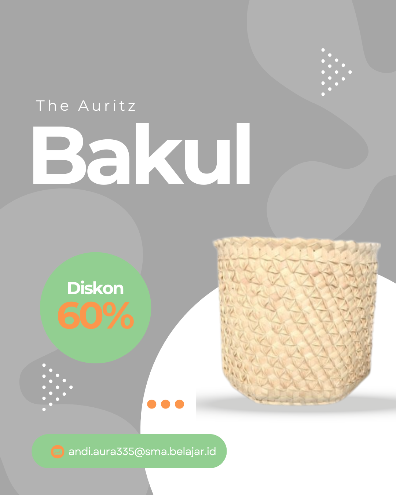

<!DOCTYPE html>
<html lang="id">
<head>
  <meta charset="UTF-8" />
  <meta name="viewport" content="width=device-width, initial-scale=1.0" />
  <title>The Auritz</title>
  <!-- Bootstrap CDN -->
  <link href="https://cdn.jsdelivr.net/npm/bootstrap@5.3.3/dist/css/bootstrap.min.css" rel="stylesheet">
  <!-- Google Fonts -->
  <link href="https://fonts.googleapis.com/css2?family=Inter:wght@400;700&display=swap" rel="stylesheet">
  
</head>
<body>

  <!-- Navbar -->
  <nav class="navbar navbar-expand-lg navbar-dark bg-dark fixed-top">
    

      <a class="navbar-brand" href="#">The Auritz</a>
      <button class="navbar-toggler" type="button" data-bs-toggle="collapse" data-bs-target="#navbarNav">
        
      </button>
      
      

        <ul class="navbar-nav ms-auto">
          <li class="nav-item">
            <a class="nav-link active" href="#">Home</a>
          </li>
          <li class="nav-item">
            <a class="nav-link" href="#">Produk</a>
          </li>
          <li class="nav-item">
            <a class="nav-link" href="#">Tentang Kami</a>
          </li>
          <li class="nav-item">
            <a class="nav-link" href="#">Kontak</a>
          </li>
        </ul>
      

    
BB
  </nav>

  <!-- Hero Section (Welcome Section) -->
  <section class="hero-section">
    
    

      <h1>Selamat Datang di The Auritz</h1>
      
Temukan berbagai macam produk fashion dan aksesori yang trendy untuk melengkapi gaya Anda.

      <a href="#produk" class="btn btn-primary">Lihat Produk</a>
    

  </section>

  <!-- Button Tags for Filtering -->
  <section class="container mt-5">
    <h2 class="text-center mb-4">Filter Berdasarkan Kategori</h2>
    

      <button class="btn btn-secondary tag-button">Sepatu</button>
      <button class="btn btn-secondary tag-button">Tas</button>
      <button class="btn btn-secondary tag-button">Aksesori</button>
      <button class="btn btn-secondary tag-button">Pakaian</button>
      <button class="btn btn-secondary tag-button">Anyaman Serat Lontar</button>
    

  </section>

  <!-- Produk Section -->
<section id="produk" class="py-5">
  

    <h2 class="text-center mb-4">Produk Unggulan</h2>
    

      <!-- Produk ngguUlan: Songkok Guru -->
      

        

          
          

            <h5 class="card-title">Songkok Guru</h5>
            
Songkok tradisional yang dibuat dengan serat lontar, dihiasi aksara lontarak yang sarat makna budaya.

            
Rp 150.000

            <a href="#" class="btn btn-primary">Beli Sekarang</a>
          

        

      

      <!-- Produk Unggulan: Bakul -->
      

        

          
          

            <h5 class="card-title">Bakul</h5>
            
Bakul anyaman dari serat lontar yang indah, dipadukan dengan aksara lontarak, menciptakan karya seni yang fungsional.

            
Rp 100.000

            <a href="#" class="btn btn-primary">Beli Sekarang</a>
          

        

      

      <!-- Produk Unggulan: Kipas Serat Lontar -->
      

        

          
          

            <h5 class="card-title">Kipas Serat Lontarak</h5>
            
Kipas tradisional yang terbuat dari serat lontar dengan desain aksara lontarak yang elegan dan penuh makna.

            
Rp 50.000

            <a href="#" class="btn btn-primary">Beli Sekarang</a>
          

        

      

    

  

</section>

  <!-- Produk Section -->
  <section id="produk" class="py-5">
    

      <h2 class="text-center mb-4">Produk Unggulan</h2>
      

        <!-- Produk 1: Sepatu Sport -->
        

          

             <!-- Gambar Produk 1 -->
            

              <h5 class="card-title">Sepatu Sport</h5>
              
Sepatu sport nyaman untuk berbagai aktivitas outdoor.

            

          

        

        <!-- Produk 2: Tote Bag Canvas -->
        

          

             <!-- Gambar Produk 2 -->
            

              <h5 class="card-title">Tote Bag Canvas</h5>
              
Tas canvas trendy untuk keperluan sehari-hari.

            

          

        

        <!-- Produk 3: Kacamata Hitam Trendy -->
        

          

             <!-- Gambar Produk 3 -->
            

              <h5 class="card-title">Kacamata Hitam Trendy</h5>
              
Kacamata hitam dengan desain fashionable dan modern.

            

          

        

        <!-- Produk 4: Earphone Wireless -->
        

          

             <!-- Gambar Produk 4 -->
            

              <h5 class="card-title">Earphone Wireless</h5>
              
Earphone wireless dengan kualitas suara terbaik dan nyaman dipakai.

            

          

        

        <!-- Produk 5: Hoodie Oversize -->
        

          

             <!-- Gambar Produk 5 -->
            

              <h5 class="card-title">Hoodie Oversize</h5>
              
Hoodie oversize yang nyaman dan stylish untuk cuaca dingin.

            

          

        

        <!-- Produk 6: Casing HP Lucu -->
        

          

             <!-- Gambar Produk 6 -->
            

              <h5 class="card-title">Casing HP Lucu</h5>
              
Casing HP dengan desain lucu dan keren untuk smartphone Anda.

            

          

        

        <!-- Produk 7: Celana Cargo -->
        

          

             <!-- Gambar Produk 7 -->
            

              <h5 class="card-title">Celana Cargo</h5>
              
Celana cargo dengan desain modern dan banyak kantong praktis.

            

          

        

        <!-- Produk 8: Kaos Graphic Tee -->
        

          

             <!-- Gambar Produk 8 -->
            

              <h5 class="card-title">Kaos Graphic Tee</h5>
              
Kaos dengan desain grafis yang trendy dan unik.

            

          

        

        <!-- Produk 9: Gelang Manik-Manik -->
        

          

             <!-- Gambar Produk 9 -->
            

              <h5 class="card-title">Gelang Manik-Manik</h5>
              
Gelang manik-manik dengan desain etnik dan unik.

            

          

        

        <!-- Produk 10: Parfum Pocket Size -->
        

          

             <!-- Gambar Produk 10 -->
            

              <h5 class="card-title">Parfum Pocket Size</h5>
              
Parfum ukuran kecil yang praktis untuk dibawa kemana saja.

            

          

        

        <!-- Produk 11: Jaket Varsity -->
        

          

             <!-- Gambar Produk 11 -->
            

              <h5 class="card-title">Jaket Varsity</h5>
              
Jaket varsity dengan desain sporty dan nyaman untuk musim dingin.

            

          

        

      

    

  </section>

 <!-- Footer -->
<footer class="bg-dark text-white py-4">
  

    
&copy; 2025 The Auritz. Semua Hak Dilindungi.

    

      <!-- Sosial Media Links -->
      <a href="https://facebook.com/TheAuritz" target="_blank" class="text-white mx-2">
        <i class="fab fa-facebook"></i> Facebook
      </a>|
      <a href="https://instagram.com/TheAuritz" target="_blank" class="text-white mx-2">
        <i class="fab fa-instagram"></i> Instagram
      </a>|
      <a href="https://twitter.com/TheAuritz" target="_blank" class="text-white mx-2">
        <i class="fab fa-twitter"></i> Twitter
      </a>
    

  

</footer>

<!-- CDN Bootstrap CSS -->
<link href="https://cdn.jsdelivr.net/npm/bootstrap@5.3.3/dist/css/bootstrap.min.css" rel="stylesheet">

<!-- Font Awesome CDN (untuk icon sosial media) -->
<link href="https://cdnjs.cloudflare.com/ajax/libs/font-awesome/6.0.0-beta3/css/all.min.css" rel="stylesheet">

<!-- CDN Bootstrap JS -->

<a href="https://wa.me/6285395247576?text=Halo%20saya%20mau%20beli%20produk%20ini" target="_blank" class="btn btn-success btn-lg w-100 mt-3">
  Beli Sekarang via WhatsApp
</a>

